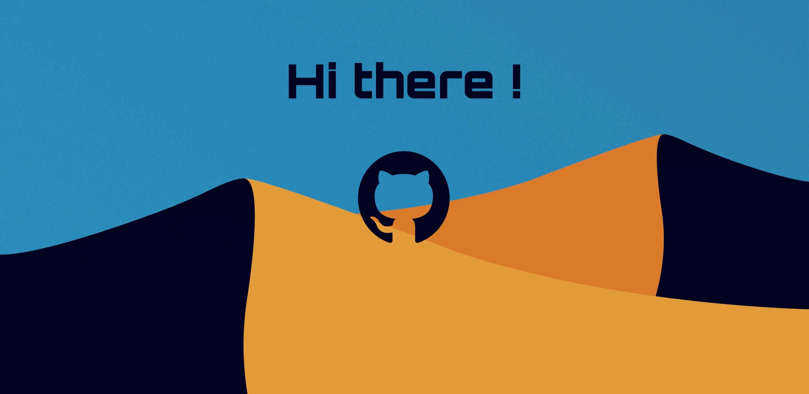

# About Me:
Hello! My name is Diego Manuel Viera Martínez, and I am a Computer Science student passionate about software development and technology. My native language is Spanish, and I am always looking for new opportunities to learn and grow in the programming world.  I am a big fan of Apple and love to explore their technologies and ecosystems. I also have a strong interest in game development, where I can apply my creativity and technical skills. I enjoy participating in collaborative projects, where I can use my knowledge and acquire new skills. I am particularly interested in areas such as artificial intelligence, web development, and systems programming.   My hobbies include creating pixel art and going to the gym to stay healthy and fit. These activities help me stay creative and balanced. I am excited to contribute to open-source projects and collaborate with other technology enthusiasts.  If you have a project in mind or just want to chat about technology, feel free to reach out!

# Tech Stack:
             

# GitHub Stats:

 

 

### Top Contributed Repo

## GitHub Trophies

## Socials:

### Random Dev Quote

---

<!-- Proudly created with GPRM ( https://gprm.itsvg.in ) -->
